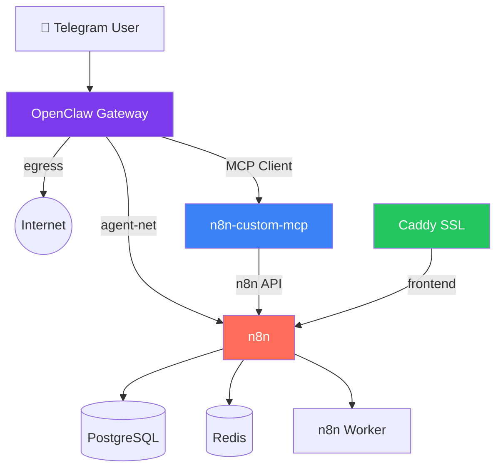

# OpenClaw + n8n + MCP Stack v2 (by duynghien)

[English](#english) | [Tiếng Việt](#tiếng-việt)

---

## English

Automatic setup script for a **Super Agent** ecosystem — OpenClaw AI agent integrated with n8n automation and MCP (Model Context Protocol).

### 🚀 Feature Overview

| Feature | Description | Toggle |
|---|---|---|
| **OpenClaw Gateway** | Core routing & session management | Always ON |
| **n8n Automation** | Full n8n stack (Postgres, Redis, Worker) | Always ON |
| **n8n MCP Server** | Agent controls n8n directly via MCP protocol | ✅ ON/OFF |
| **Watchtower** | Auto-update Docker containers daily | ✅ ON/OFF |
| **Auto Backup** | Daily backup of n8n data + configs (3 AM) | ✅ ON/OFF |
| **Web Browsing** | Agent skill for web search & page reading | ✅ ON/OFF |
| **Multi-model** | Support Anthropic, DeepSeek alongside OpenAI | ✅ ON/OFF |
| **System Prompt** | Custom agent behavior instructions | ✅ ON/OFF |
| **Security** | Network isolation (requires external Proxy for SSL) | Always ON |
| **Health Checks** | All containers monitored with auto-restart | Always ON |
| **Helper Script** | `openclaw` CLI for easy management | Always ON |

### 🏗 Architecture



### 📋 Requirements
- **OS**: Ubuntu 22.04+ or macOS (with Docker Desktop)
- **Specs**: 4GB RAM, 2 vCPUs minimum
- **Keys**: Telegram Bot Token, Telegram User ID, OpenAI API Key

### 🛠️ Installation

```bash
curl -O https://raw.githubusercontent.com/duynghien/auto/main/openclaw-n8n-mcp/setup.sh
chmod +x setup.sh
sudo ./setup.sh  # Linux (macOS: ./setup.sh)
```

The script guides you through:
1. **Feature selection** — toggle features ON/OFF via interactive menu
2. **Credential input** — API keys, domain/IP
3. **Automatic build** — Docker images built from source
4. **Service startup** — all containers launched with health checks

### 🔌 Reverse Proxy Setup (Required for Public Access)

This stack exposes n8n on port `5678` (internal). To access it securely from the internet (HTTPS), you need a Reverse Proxy.

We provide a **Unified Proxy Setup** supporting:
- **Cloudflare Tunnel** (Recommended - No open ports)
- **Nginx Proxy Manager** (GUI)
- **Caddy** (Simple CLI)

👉 **[Click here to setup Proxy](../proxies/README.md)**

### ⚙️ Feature Toggles

Features can be toggled during installation or modified later:

```bash
# View current features
openclaw features

# Edit features
nano ~/self-hosted/openclaw/features.env

# Apply changes
cd ~/self-hosted/openclaw && docker compose up -d
```

### 📋 Post-Install: MCP Configuration

If you skipped the n8n API Key during setup:

1. Go to `https://n8n.<YOUR_DOMAIN>`
2. Create your n8n account
3. **Settings > Personal API Keys > Create New**
4. Edit: `nano ~/self-hosted/openclaw/.env`
5. Replace `REPLACE_ME_LATER` with your key
6. Restart: `cd ~/self-hosted/openclaw && docker compose up -d n8n-mcp`

### 🛠 Helper Commands

```bash
openclaw status       # View all container statuses
openclaw logs         # View all logs (live)
openclaw logs n8n     # View n8n logs only
openclaw restart      # Restart all services
openclaw restart n8n  # Restart specific service
openclaw backup       # Run manual backup
openclaw update       # Pull latest images
openclaw features     # View feature toggles
openclaw env          # View environment (values hidden)
```

### 📂 Directory Structure
```
~/self-hosted/openclaw/
├── docker-compose.yml    # Service definitions
├── .env                  # Credentials & config
├── features.env          # Feature toggles
├── openclaw.sh           # Helper script
├── backup.sh             # Backup script (if enabled)
├── data/                 # OpenClaw agent data
│   ├── openclaw.json     # Agent configuration
│   └── workspace/
│       ├── system-prompt.md
│       └── skills/
│           ├── n8n-webhook/SKILL.md
│           ├── n8n-mcp/SKILL.md
│           ├── web-browse/SKILL.md
│           └── system-info/SKILL.md

├── src/                  # Source repos
│   ├── openclaw/
│   └── n8n-custom-mcp/
└── backups/              # Backup files
```

### 🤝 Contact & Support
- **Website**: [vnrom.net](https://vnrom.net)
- **Author**: [duynghien](https://github.com/duynghien)
- **Community**: [AI & Automation (vnROM)](https://ai.vnrom.net)

### 📜 Credits
Inspired by [openclaw-n8n-starter](https://github.com/Barty-Bart/openclaw-n8n-starter).

---

## Tiếng Việt

Script cài đặt tự động hệ sinh thái **Siêu Agent** — OpenClaw AI tích hợp n8n automation và MCP (Model Context Protocol).

### 🚀 Tổng quan tính năng

| Tính năng | Mô tả | Bật/Tắt |
|---|---|---|
| **OpenClaw Gateway** | Điều phối routing & quản lý session | Luôn BẬT |
| **n8n Automation** | Stack n8n đầy đủ (Postgres, Redis, Worker) | Luôn BẬT |
| **n8n MCP Server** | Agent điều khiển n8n trực tiếp qua MCP | ✅ BẬT/TẮT |
| **Watchtower** | Tự động cập nhật Docker containers | ✅ BẬT/TẮT |
| **Auto Backup** | Backup tự động hàng ngày (3h sáng) | ✅ BẬT/TẮT |
| **Web Browsing** | Skill duyệt web, tìm kiếm thông tin | ✅ BẬT/TẮT |
| **Multi-model** | Hỗ trợ Anthropic, DeepSeek bên cạnh OpenAI | ✅ BẬT/TẮT |
| **System Prompt** | Tùy chỉnh hành vi agent | ✅ BẬT/TẮT |
| **Security** | Cô lập mạng (cần Proxy ngoài để có SSL) | Luôn BẬT |
| **Health Checks** | Theo dõi & tự restart containers | Luôn BẬT |
| **Helper Script** | CLI `openclaw` quản lý dễ dàng | Luôn BẬT |

### 📋 Yêu cầu hệ thống
- **OS**: Ubuntu 22.04+ hoặc macOS (cần Docker Desktop)
- **Cấu hình**: 4GB RAM, 2 vCPUs trở lên
- **Keys**: Telegram Bot Token, Telegram User ID, OpenAI API Key

### 🛠️ Cài đặt

```bash
curl -O https://raw.githubusercontent.com/duynghien/auto/main/openclaw-n8n-mcp/setup.sh
chmod +x setup.sh
sudo ./setup.sh  # Linux (macOS: ./setup.sh)
```

Script sẽ hướng dẫn bạn qua:
1. **Chọn tính năng** — bật/tắt qua menu tương tác
2. **Nhập thông tin** — API keys, domain/IP
3. **Build tự động** — Docker images từ source
4. **Khởi động** — tất cả containers với health checks

### 🔌 Cài đặt Reverse Proxy (Bắt buộc để Public)

Stack này chạy n8n ở port `5678` (nội bộ). Để truy cập từ Internet (HTTPS), bạn cần Reverse Proxy.

Chúng tôi cung cấp bộ **Unified Proxy Setup** hỗ trợ:
- **Cloudflare Tunnel** (Khuyên dùng - Không cần mở port)
- **Nginx Proxy Manager** (Giao diện web)
- **Caddy** (Đơn giản)

👉 **[Xem hướng dẫn cài Proxy tại đây](../proxies/README.md)**

### ⚙️ Bật/Tắt tính năng

Tính năng có thể thay đổi khi cài đặt hoặc sau này:

```bash
# Xem tính năng hiện tại
openclaw features

# Sửa tính năng
nano ~/self-hosted/openclaw/features.env

# Áp dụng
cd ~/self-hosted/openclaw && docker compose up -d
```

### 📋 Sau cài đặt: Cấu hình MCP

Nếu bạn bỏ qua n8n API Key lúc cài đặt:

1. Truy cập `https://n8n.<DOMAIN_CUA_BAN>`
2. Tạo tài khoản n8n
3. **Settings > Personal API Keys > Create New**
4. Sửa file: `nano ~/self-hosted/openclaw/.env`
5. Thay `REPLACE_ME_LATER` bằng key vừa tạo
6. Restart: `cd ~/self-hosted/openclaw && docker compose up -d n8n-mcp`

### 🛠 Lệnh quản lý

```bash
openclaw status       # Xem trạng thái containers
openclaw logs         # Xem logs (realtime)
openclaw logs n8n     # Xem logs n8n
openclaw restart      # Restart tất cả
openclaw restart n8n  # Restart dịch vụ cụ thể
openclaw backup       # Backup thủ công
openclaw update       # Cập nhật images
openclaw features     # Xem feature toggles
openclaw env          # Xem environment (ẩn giá trị)
```

### 📂 Cấu trúc thư mục
```
~/self-hosted/openclaw/
├── docker-compose.yml    # Định nghĩa services
├── .env                  # Credentials & cấu hình
├── features.env          # Bật/Tắt tính năng
├── openclaw.sh           # Script quản lý
├── backup.sh             # Script backup (nếu bật)
├── data/                 # Dữ liệu OpenClaw
│   ├── openclaw.json     # Cấu hình agent
│   └── workspace/
│       ├── system-prompt.md
│       └── skills/
│           ├── n8n-webhook/SKILL.md
│           ├── n8n-mcp/SKILL.md
│           ├── web-browse/SKILL.md
│           └── system-info/SKILL.md

├── src/                  # Source repos
│   ├── openclaw/
│   └── n8n-custom-mcp/
└── backups/              # File backup
```

### 🆕 Có gì mới so với v1?

| | v1 | v2 |
|---|---|---|
| Agent | ❌ Chỉ Gateway | ✅ Gateway đầy đủ |
| MCP | ❌ Chỉ skill text | ✅ Native MCP client |
| n8n | ⚠️ Thiếu env vars | ✅ Full env (community packages, timezone) |
| Network | ⚠️ Cô lập sai | ✅ `agent-net` cho giao tiếp nội bộ |
| Toggle | ❌ Không có | ✅ Menu interactive + `features.env` |
| Health | ❌ Không có | ✅ Tất cả services |
| Helper | ❌ Không có | ✅ `openclaw` CLI |
| OS | ⚠️ Chỉ Ubuntu | ✅ Ubuntu + macOS |
| Backup | ❌ Không có | ✅ Tùy chọn |

### 🤝 Liên hệ & Hỗ trợ
- **Website**: [vnrom.net](https://vnrom.net)
- **Author**: [duynghien](https://github.com/duynghien)
- **Cộng đồng**: [AI & Automation (vnROM)](https://ai.vnrom.net)

### 📜 Ghi công
Lấy cảm hứng từ [openclaw-n8n-starter](https://github.com/Barty-Bart/openclaw-n8n-starter).
