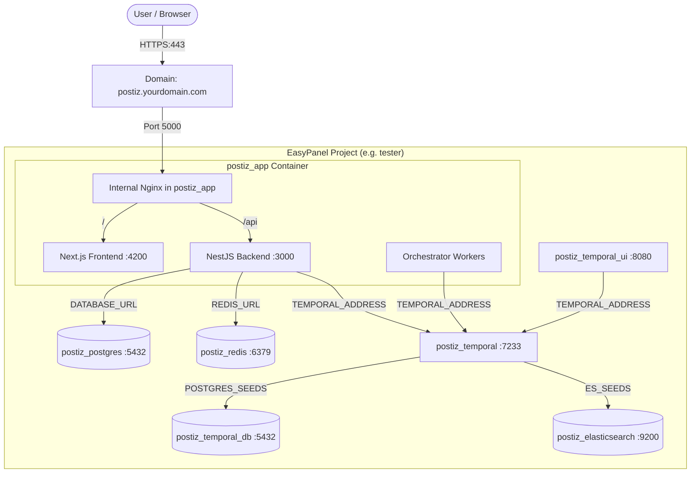

# EasyPanel Postiz Deployment Skill

Skill này hướng dẫn quy trình toàn diện từ việc thiết lập **EasyPanel MCP**, triển khai cụm microservice **Postiz Stack** trên EasyPanel, cho đến việc cấu hình các biến môi trường tích hợp mạng xã hội (Facebook, X/Twitter, Threads, YouTube, LinkedIn...) và AI (OpenAI).

---

## 1. Tổng quan Kiến trúc Postiz trên EasyPanel

Postiz yêu cầu một hệ sinh thái gồm 7 microservices độc lập để vận hành ổn định:



---

## 2. Bước 1: Cài đặt & Cấu hình EasyPanel MCP

### 2.1. Lấy API Token từ EasyPanel
1. Truy cập vào dashboard EasyPanel của bạn: `https://your-panel.example.com`.
2. Đi đến: **Settings** -> **API** -> **Generate Token**.
3. Sao chép API Token vừa tạo (Lưu ý: Không chia sẻ hoặc commit token vào Git).

### 2.2. Cấu hình MCP Client

#### Đối với Antigravity
Mở cấu hình MCP tại `~/.gemini/antigravity/mcp_config.json` (hoặc qua UI: `Agent panel -> ... -> Manage MCP Servers -> View raw config`):

```json
{
  "mcpServers": {
    "easypanel-mcp": {
      "command": "npx",
      "args": ["-y", "easypanel-mcp-server"],
      "env": {
        "EASYPANEL_URL": "https://your-panel.example.com",
        "EASYPANEL_TOKEN": "your-api-token"
      }
    }
  }
}
```

#### Đối với Claude Code / Claude Desktop / Cursor
Thêm cấu hình vào file `.mcp.json` (hoặc Cursor MCP settings):

```json
{
  "mcpServers": {
    "easypanel-mcp": {
      "command": "npx",
      "args": ["-y", "easypanel-mcp-server"],
      "env": {
        "EASYPANEL_URL": "https://your-panel.example.com",
        "EASYPANEL_TOKEN": "your-api-token"
      }
    }
  }
}
```

#### Đối với Codex CLI (`~/.codex/config.toml`)
```toml
[mcp_servers.easypanel-mcp]
command = "npx"
args = ["-y", "easypanel-mcp-server"]
enabled = true

[mcp_servers.easypanel-mcp.env]
EASYPANEL_URL = "https://your-panel.example.com"
EASYPANEL_TOKEN = "your-api-token"
```

### 2.3. Kiểm tra kết nối MCP
Gọi tool `list_projects` hoặc `get_panel_capabilities` qua MCP:
```json
{
  "ServerName": "easypanel-mcp",
  "ToolName": "list_projects",
  "Arguments": {}
}
```
*Nếu trả về danh sách projects thành công (status 200), MCP đã sẵn sàng.*

---

## 3. Bước 2: Triển khai Cụm Postiz Stack trên EasyPanel

Giả sử project mục tiêu là `<project_name>` (ví dụ: `tester`). Toàn bộ service sẽ tuân thủ tiền tố `postiz_*`.

### 3.1. Tạo CSDL & Cache
1. **`postiz_postgres`**:
   - Tool `create_service`: `projectName: "<project_name>"`, `serviceName: "postiz_postgres"`
   - Tool `set_source_image`: `image: "postgres:17-alpine"`
   - Tool `set_service_mounts`: `[{"type": "volume", "name": "postiz_pgdata", "mountPath": "/var/lib/postgresql/data"}]`
   - Tool `set_env_vars_bulk`:
     ```dotenv
     POSTGRES_USER=postiz
     POSTGRES_PASSWORD=<secure_postgres_password>
     POSTGRES_DB=postiz
     ```
   - Tool `deploy_service`: deploy service.

2. **`postiz_redis`**:
   - Tool `create_service`: `projectName: "<project_name>"`, `serviceName: "postiz_redis"`
   - Tool `set_source_image`: `image: "redis:7.2-alpine"`
   - Tool `set_service_mounts`: `[{"type": "volume", "name": "postiz_redisdata", "mountPath": "/data"}]`
   - Tool `deploy_service`: deploy service.

---

### 3.2. Tạo Hạ Tầng Temporal Workflow Engine
1. **`postiz_temporal_db`**:
   - Tool `create_service`: `serviceName: "postiz_temporal_db"`
   - Tool `set_source_image`: `image: "postgres:16-alpine"`
   - Tool `set_service_mounts`: `[{"type": "volume", "name": "postiz_temporal_pgdata", "mountPath": "/var/lib/postgresql/data"}]`
   - Tool `set_env_vars_bulk`:
     ```dotenv
     POSTGRES_USER=temporal
     POSTGRES_PASSWORD=temporal
     POSTGRES_DB=temporal
     ```
   - Tool `deploy_service`.

2. **`postiz_elasticsearch`**:
   - Tool `create_service`: `serviceName: "postiz_elasticsearch"`
   - Tool `set_source_image`: `image: "elasticsearch:7.17.27"`
   - Tool `set_service_mounts`: `[{"type": "volume", "name": "postiz_esdata", "mountPath": "/usr/share/elasticsearch/data"}]`
   - Tool `set_env_vars_bulk`:
     ```dotenv
     discovery.type=single-node
     ES_JAVA_OPTS=-Xms256m -Xmx256m
     xpack.security.enabled=false
     ```
   - Tool `deploy_service`.

3. **`postiz_temporal`**:
   - Tool `create_service`: `serviceName: "postiz_temporal"`
   - Tool `set_source_image`: `image: "temporalio/auto-setup:1.28.1"`
   - Tool `set_service_mounts`:
     - `type: "file"`, `mountPath: "/etc/temporal/config/dynamicconfig/development-sql.yaml"`
     - `content`:
       ```yaml
       system.forceSearchAttributesCacheRefreshOnRead:
         - value: true
           constraints: {}
       limit.maxIDLength:
         - value: 255
           constraints: {}
       ```
   - Tool `set_env_vars_bulk`:
     ```dotenv
     DB=postgres12
     DB_PORT=5432
     POSTGRES_USER=temporal
     POSTGRES_PWD=temporal
     POSTGRES_SEEDS=<project_name>_postiz_temporal_db
     DYNAMIC_CONFIG_FILE_PATH=config/dynamicconfig/development-sql.yaml
     ENABLE_ES=true
     ES_SEEDS=<project_name>_postiz_elasticsearch
     ES_VERSION=v7
     ```
   - Tool `deploy_service`.

4. **`postiz_temporal_ui`** (Tùy chọn giám sát):
   - Tool `create_service`: `serviceName: "postiz_temporal_ui"`
   - Tool `set_source_image`: `image: "temporalio/ui:2.34.0"`
   - Tool `set_env_vars_bulk`:
     ```dotenv
     TEMPORAL_ADDRESS=<project_name>_postiz_temporal:7233
     TEMPORAL_CORS_ORIGINS=http://localhost:3000
     ```
   - Tool `deploy_service`.

---

### 3.3. Tạo Postiz Main App (`postiz_app`)

> [!CAUTION]
> **CỰC KỲ QUAN TRỌNG (PORT CONFIGURATION):**
> Trong container `ghcr.io/gitroomhq/postiz-app:latest`:
> 1. Nginx nội bộ lắng nghe cổng `5000`.
> 2. Next.js Frontend chạy cổng `4200`.
> 3. NestJS Backend đọc biến môi trường `PORT` để bind cổng.
> **BẮT BUỘC PHẢI THIẾT LẬP:** `PORT=3000` và `BACKEND_INTERNAL_URL=http://localhost:3000`. Nếu thiếu biến này, backend sẽ cố mở cổng `5000`, xung đột với Nginx (`EADDRINUSE`) và gây ra lỗi **502 Bad Gateway**.

- Tool `create_service`: `serviceName: "postiz_app"`
- Tool `set_source_image`: `image: "ghcr.io/gitroomhq/postiz-app:latest"`
- Tool `set_service_mounts`: `[{"type": "volume", "name": "postiz_uploads", "mountPath": "/uploads"}]`
- Tool `add_domain`: `host: "postiz.yourdomain.com"`, `port: 5000`, `https: true`, `path: "/"`
- Tool `set_env_vars_bulk`:
  ```dotenv
  NODE_ENV=production
  PORT=3000
  MAIN_URL=https://postiz.yourdomain.com
  FRONTEND_URL=https://postiz.yourdomain.com
  NEXT_PUBLIC_BACKEND_URL=https://postiz.yourdomain.com/api
  BACKEND_INTERNAL_URL=http://localhost:3000
  DATABASE_URL=postgresql://postiz:<secure_postgres_password>@<project_name>_postiz_postgres:5432/postiz
  REDIS_URL=redis://<project_name>_postiz_redis:6379
  JWT_SECRET=<random_64_hex_secret>
  IS_GENERAL=true
  DISABLE_REGISTRATION=false
  API_LIMIT=300
  STORAGE_PROVIDER=local
  UPLOAD_DIRECTORY=/uploads
  NEXT_PUBLIC_UPLOAD_DIRECTORY=/uploads
  TEMPORAL_ADDRESS=<project_name>_postiz_temporal:7233
  NX_ADD_PLUGINS=false
  ```
- Tool `deploy_service`: Chạy deploy để tạo container mới và nạp biến môi trường.

---

## 4. Bước 3: Cấu hình API Mạng Xã Hội & AI (Providers)

Theo tài liệu chính thức [Postiz Self-Host Providers](https://docs.postiz.com/self-host/providers/), để kết nối các nền tảng mạng xã hội, bạn cần tạo Developer App trên từng nền tảng và thêm các biến môi trường sau vào service `postiz_app`.

### 4.1. Quy tắc Callback / Redirect URI
Trên trang Developer Portal của từng mạng xã hội, cấu hình Redirect URI theo định dạng chuẩn:
```text
https://postiz.yourdomain.com/integrations/social/<provider>
```
*Ví dụ:*
* X / Twitter: `https://postiz.yourdomain.com/integrations/social/x`
* Facebook: `https://postiz.yourdomain.com/integrations/social/facebook`
* Threads: `https://postiz.yourdomain.com/integrations/social/threads`
* LinkedIn: `https://postiz.yourdomain.com/integrations/social/linkedin`
* YouTube: `https://postiz.yourdomain.com/integrations/social/youtube`

---

### 4.2. Danh sách Biến Môi Trường Chi Tiết

Dưới đây là mẫu danh sách các biến môi trường mở rộng cho `postiz_app`:

```dotenv
# ==============================================================================
# SOCIAL MEDIA API KEYS (https://docs.postiz.com/self-host/providers/)
# ==============================================================================

# --- Meta (Facebook & Instagram) ---
FACEBOOK_APP_ID=""
FACEBOOK_APP_SECRET=""

# --- Threads ---
THREADS_APP_ID=""
THREADS_APP_SECRET=""

# --- X / Twitter (Lưu ý: App Type phải chọn 'Native App' cho OAuth 1.0a) ---
X_API_KEY=""
X_API_SECRET=""

# --- Google / YouTube / Google My Business ---
YOUTUBE_CLIENT_ID=""
YOUTUBE_CLIENT_SECRET=""

# --- LinkedIn ---
LINKEDIN_CLIENT_ID=""
LINKEDIN_CLIENT_SECRET=""

# --- Reddit ---
REDDIT_CLIENT_ID=""
REDDIT_CLIENT_SECRET=""

# --- Pinterest ---
PINTEREST_CLIENT_ID=""
PINTEREST_CLIENT_SECRET=""

# --- TikTok ---
TIKTOK_CLIENT_ID=""
TIKTOK_CLIENT_SECRET=""

# --- Dribbble ---
DRIBBBLE_CLIENT_ID=""
DRIBBBLE_CLIENT_SECRET=""

# --- Discord ---
DISCORD_CLIENT_ID=""
DISCORD_CLIENT_SECRET=""
DISCORD_BOT_TOKEN_ID=""

# --- Slack ---
SLACK_ID=""
SLACK_SECRET=""
SLACK_SIGNING_SECRET=""

# --- Mastodon ---
MASTODON_URL="https://mastodon.social"
MASTODON_CLIENT_ID=""
MASTODON_CLIENT_SECRET=""

# --- AI & Content Generation ---
OPENAI_API_KEY=""
OPENAI_OAUTH_CLIENT_ID=""

# ==============================================================================
# CÁC NỀN TẢNG KHÔNG CẦN CONFIG ENV (Người dùng nhập trực tiếp trên Web UI):
# Bluesky, Mastodon (custom instance), Nostr, Lemmy, Telegram, Medium,
# Dev.to, Hashnode, WordPress, Listmonk.
# ==============================================================================
```

### 4.3. Cách áp dụng biến môi trường qua EasyPanel MCP
Khi thêm/sửa các API key, thực hiện theo 2 bước:
1. Gọi `set_env_vars_bulk` với `mode: "replace"`, `confirm: "CONFIRMO"` (bao gồm toàn bộ biến core và biến social).
2. **BẮT BUỘC** gọi `deploy_service` để EasyPanel tái tạo container với các key mới.

---

## 5. Bước 4: Kiểm tra & Khắc phục Lỗi Thường Gặp

### Kiểm tra Logs
* Xem log của `postiz_app`:
  ```json
  {
    "ServerName": "easypanel-mcp",
    "ToolName": "get_service_logs",
    "Arguments": {
      "projectName": "<project_name>",
      "serviceName": "postiz_app",
      "lines": 100
    }
  }
  ```
* Xem trạng thái container:
  ```json
  {
    "ServerName": "easypanel-mcp",
    "ToolName": "list_containers",
    "Arguments": {
      "projectName": "<project_name>",
      "serviceName": "postiz_app"
    }
  }
  ```

### Các lỗi phổ biến & Cách xử lý:
1. **Lỗi `502 Bad Gateway` khi đăng ký / truy cập `/api`:**
   * *Nguyên nhân:* Backend NestJS chưa chạy hoặc bị xung đột cổng `5000`.
   * *Khắc phục:* Kiểm tra biến `PORT=3000` và `BACKEND_INTERNAL_URL=http://localhost:3000`, sau đó chạy `deploy_service`.
2. **Lỗi `524 Gateway Timeout` khi deploy `postiz_app`:**
   * *Nguyên nhân:* Image `ghcr.io/gitroomhq/postiz-app:latest` có dung lượng lớn, Cloudflare timeout kết nối HTTP của EasyPanel tRPC API.
   * *Khắc phục:* Quá trình pull image vẫn chạy ngầm trên server. Dùng `list_actions` để theo dõi đến khi status chuyển sang `done`.
3. **Bài viết lên lịch bị kẹt ở trạng thái `QUEUE`:**
   * *Nguyên nhân:* `postiz_app` không kết nối được tới Temporal gRPC Server (`TEMPORAL_ADDRESS`).
   * *Khắc phục:* Kiểm tra log của `postiz_temporal` xem Elasticsearch và Postgres đã ready chưa. Đảm bảo hostname là `<project_name>_postiz_temporal:7233`.
